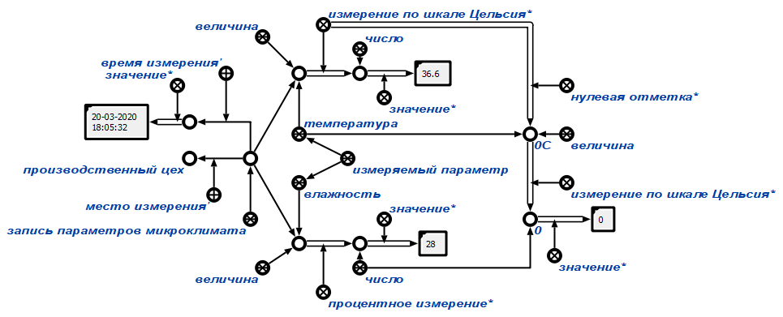

# Project Title

## Table of Contents

- [Project Title](#project-title)
  - [Table of Contents](#table-of-contents)
  - [About <a name = "about"></a>](#about)
  - [Getting Started <a name = "getting_started"></a>](#getting-started)
  - [Usage <a name = "usage"></a>](#usage)
  - [Setting Up <a name = "setting_up"></a>](#setting-up)
  - [Writing custom sketch for microcontroller <a name = "custom_sketch"></a>](#writing-custom-sketch-for-microcontroller)

## About <a name = "about"></a>

This client is created for providing interaction between OSTIS and microcontrollers by COM-port and WEB-socket. It records microclimate parameters
(such as temperature, humidity, etc.) into SC-memory.

## Getting Started <a name = "getting_started"></a>
You need to install:
- [OSTIS v6.0.0](https://github.com/ShunkevichDV/ostis/tree/0.6.0)
- [Python 3.8](https://www.python.org/downloads/release/python-380/)

Dependencies for Python: `tqdm`, `pyserial`, `websockets` (You can use Pipfile from `interface/` to install dependencies)

You need to have Arduino microcontroller (or another microcontroller), module to register parameters from real world and USB-wire.

Dependencies for Arduino (if you will use sketch from `interface/arduino/serial.ino`):
- [TroykaDHT](https://github.com/amperka/TroykaDHT)

See [Installing Additional Arduino Libraries](https://www.arduino.cc/en/guide/libraries)

## Usage <a name = "usage"></a>
- Run OSTIS by running `ostis/scripts/run_sctp.sh`.
- Load `interface/arduino/serial.ino` to your microcontroller (see [HOWTO](https://www.arduino.cc/en/main/howto))
- Then run `interface/hardware_client/run.py`. The client will scan all COM-ports, found microcontroller and automatically connect. Afrer receiving keynodes the microcontrollers starts to send parameters to OSTIS as following SC-construction.

- To see results from console line run `interdace/hardware_client/get_microclimate_parameters.py`

## Setting Up <a name = "setting_up"></a>
The client have a settings file located in `/interface/hardware_client/settings.py`. Let's look at each setting more closely.

- URI -- URI to OSTIS WEB-socket. `ws://localhost:8090/ws_json` by default.
- CONFIGFILE -- file to store COM-port connection parameters such as baudrate, timeout, COM-port adress. When the client is scanning COM-ports and founding microcontroller this file refreshes.
- REFRESH_SECONDS_INTERVAL -- refresh interval that client will pause process of asking microcontroller for parameters.


## Writing custom sketch for microcontroller <a name = "custom_sketch"></a>
Before sending and receiving data client and microcontroller should perform a handshake. Procedure of handshaking:
- Microcontroller sends "__transmitting" signal
- Client recieves "__transmitting" signal and sends "__recieved" signal
- Microcontroller recieves "recieves" signal

After handshaking microcontroller can start sending serialized data as JSON. JSON example:
```
{
    "temp": 36.6,
    "humi": 29
}
```
If a valid data is not recieved from module microcontroller should set "NaN" value of corresponding field.
